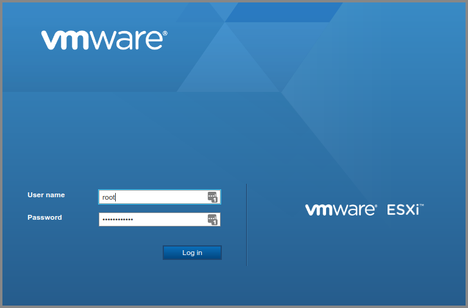
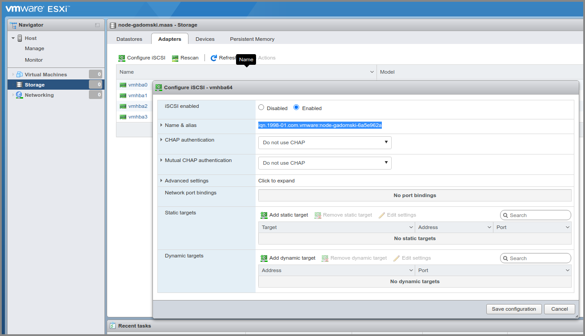
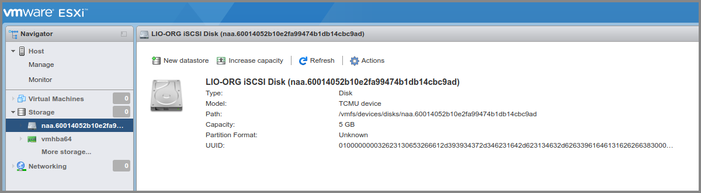

======================
Appendix W: Ceph iSCSI
======================

Overview
--------

This section contains information on the usage of Ceph-backed iSCSI targets in
a Charmed Ceph environment. See the `ceph-iscsi charm README`_ for essential
information.

VMware integration
~~~~~~~~~~~~~~~~~~

Ceph can be used to back iSCSI targets for VMware initiators.

Begin by accessing the VMware admin web UI.

.. note::

   These instructions were written using VMware ESXi 6.7.0.

   Accessing the WMware web UI.

Create a Ceph pool
^^^^^^^^^^^^^^^^^^

If desired, create a Ceph pool to back the VMware targets with the ceph-mon
charm's ``create-pool`` action. To create one called 'vmware-iscsi':

.. code-block:: none

   juju run-action --wait ceph-mon/0 create-pool name=vmware-iscsi

Enable the initiator
^^^^^^^^^^^^^^^^^^^^

From the web UI select the ``Adapters`` tab in the ``Storage`` context. Click
``Configure iSCSI`` and enable iSCSI.

Take a note of the initiator's name, also called its IQN (iSCSI Qualified
Name). Here the IQN we'll use is
``iqn.1998-01.com.vmware:node-gadomski-6a5e962a``.

   Determining the IQN for the initiator.

Create an iSCSI target
^^^^^^^^^^^^^^^^^^^^^^

With the ``create-target`` action create a target for VMware to use. Use the
pool that may have been created previously (such as 'vmware-iscsi'):

.. code-block:: none

   juju run-action --wait ceph-iscsi/0 create-target \
      client-initiatorname=iqn.1998-01.com.vmware:node-gadomski-6a5e962a \
      client-username=vmwareclient \
      client-password=12to16characters \
      image-size=5G \
      image-name=disk-1 \
      pool-name=vmware-iscsi

.. note::

   VMware imposes a policy on credentials. The username should be more than
   eight characters and the password between twelve and sixteen characters.

Add a target to VMware
^^^^^^^^^^^^^^^^^^^^^^

Follow the `Ceph iSCSI gateway for VMware`_ documentation to use the new
target. Use the (CHAP) username and password passed to the ``create-target``
action.

.. note::

   At the time of writing, the redundant task of setting the credentials via
   the ESX CLI is still a necessity. This will require you to enable SSH under
   ``Manage`` > ``Services`` > ``TSM-SSH`` > ``Actions`` (Start).

When finished, under the ``Devices`` tab you should see the created target. To
make more devices available to VMware simply create more targets (use a
different image name and optionally a different image size). You may need to
``Rescan`` and ``Refresh`` for the new devices to appear.

Clicking on one of the target devices will show its details:

   Inspecting target device details.

.. LINKS
.. _Ceph iSCSI gateway for VMware: https://docs.ceph.com/docs/master/rbd/iscsi-initiator-esx/
.. _ceph-iscsi charm README: https://opendev.org/openstack/charm-ceph-iscsi/src/branch/master/README.md
