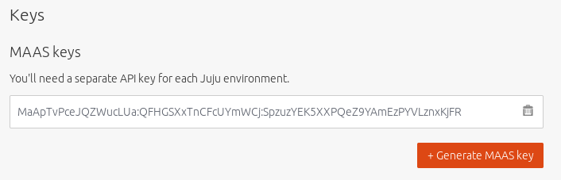

Install Juju
============

`Juju <https://jujucharms.com/about>`__ is an open source application modelling
tool that allows you to deploy, configure, scale and operate your software on
public and private clouds.

In the `previous step <./install-maas.html>`__, we installed, deployed and
configured `MAAS <https://maas.io/>`__ to use as a foundation for Juju to deploy
a fully fledged OpenStack cloud.

We are now going to install and configure the following two core components of
Juju to use our MAAS deployment:

-  The *controller* is the management node for a cloud environment. We'll be
   using the MAAS node we tagged with ``juju`` to host the Juju controller.
-  The *client* is used by the operator to talk to one or more controllers,
   managing one or more different cloud environments. As long as it can access
   the controller, almost any machine and operating system can run the Juju
   client.

Package installation
--------------------

We're going to start by installing the Juju client on a machine running `Ubuntu
16.04 <http://releases.ubuntu.com/16.04/>`__ LTS (Xenial) with network access to
the MAAS deployment. For other installation options, see `Getting started with
Juju <https://jujucharms.com/docs/stable/getting-started>`__.

To install Juju, enter the following in the terminal:

.. code:: bash

    sudo add-apt-repository -u ppa:juju/stable
    sudo apt install juju

Client configuration
--------------------

The Juju client needs two pieces of information before it can control our MAAS
deployment.

1. A cloud definition for the MAAS deployment. This definition will include
   where MAAS can be found and how Juju can authenticate itself with it.
2. A separate credentials definition that's used when accessing MAAS. This links
   the authentication details to the cloud definition.

To create the cloud definition, type ``juju add-cloud mymaas`` to add a cloud
called ``mymaas``. This will produce output similar to the following:

.. code:: bash

    Cloud Types
      maas
      manual
      openstack
      vsphere

    Select cloud type: 

Enter ``maas`` as the cloud type and you will be asked for the API endpoint URL.
This URL is the same as the URL used to access the MAAS web UI in the previous
step: ``http://<your.maas.ip>:5240/MAAS/``.

With the endpoint added, Juju will inform you that ``mymass`` was successfully
added. The next step is to add credentials. This is initiated by typing
``juju add-credential mymaas``. Enter ``admin`` when asked for a credential
name.

Juju will output the following:

.. code:: bash

    Enter credential name: admin

    Using auth-type "oauth1".

    Enter maas-oauth:

The ``oauth1`` credential value is the MAAS API key for the ``admin`` user. To
retrieve this, login to the MAAS web UI and click on the ``admin`` username near
the top right. This will show the user preferences page. The top field will hold
your MAAS keys:

   MAAS API key

Copy and paste this key into the terminal and press return. You will be informed
that credentials have been added for cloud ``mymaas``.

You can check the cloud definition has been added with the ``juju clouds``
command, and you can list credentials with the ``juju credentials`` command.

Testing the environment
-----------------------

The Juju client now has everything it needs to instruct MAAS to deploy a Juju
controller.

But before we move on to deploying OpenStack, it's worth checking that
everything is working first. To do this, we'll simply ask Juju to create a new
controller for our cloud:

.. code:: bash

    juju bootstrap --constraints tags=juju mymaas maas-controller

The constraint in the above command will ask MAAS to use any nodes tagged with
``juju`` to host the controller for the Juju client. We tagged this node within
MAAS in the `previous step <./install-maas.md#commision-nodes>`__.

The output to a successful bootstrap will look similar to the following:

.. code:: bash

    Creating Juju controller "maas-controller" on mymaas
    Looking for packaged Juju agent version 2.2-alpha1 for amd64
    Launching controller instance(s) on mymaas...
     - 7cm8tm (arch=amd64 mem=2G cores=2)
    Fetching Juju GUI 2.4.4
    Waiting for address
    Attempting to connect to 192.168.100.106:22
    Bootstrap agent now started
    Contacting Juju controller at 192.168.100.106 to verify accessibility...
    Bootstrap complete, "maas-controller" controller now available.
    Controller machines are in the "controller" model.
    Initial model "default" added.

If you're monitoring the nodes view of the MAAS web UI, you will notice that the
node we tagged with ``juju`` starts deploying Ubuntu 16.04 LTS automatically,
which will be used to host the Juju controller.

Next steps
----------

We've now installed the Juju client and given it enough details to control our
MAAS deployment, which we've tested by bootstrapping a new Juju controller. The
next step will be to use Juju to deploy and link the various components required
by OpenStack.

.. raw:: html

   <!-- LINKS -->

.. raw:: html

   <!-- IMAGES -->
