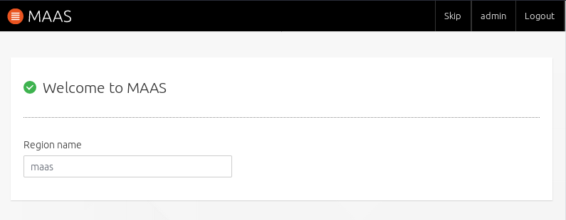
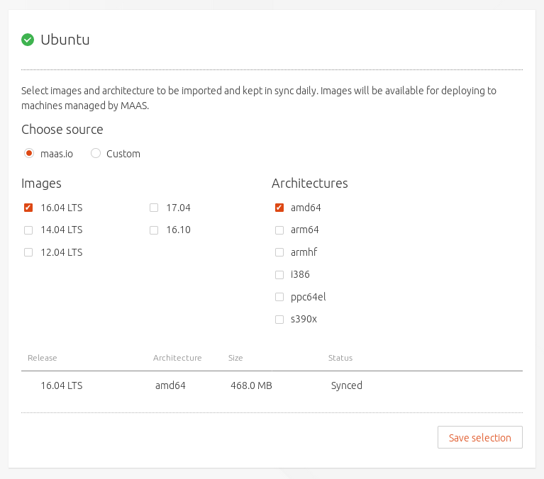
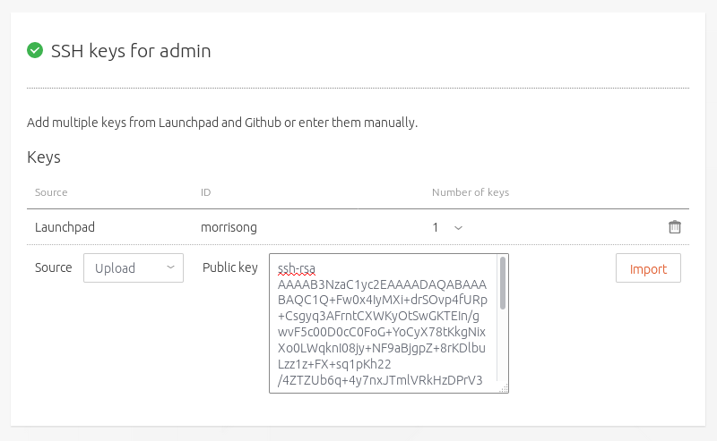
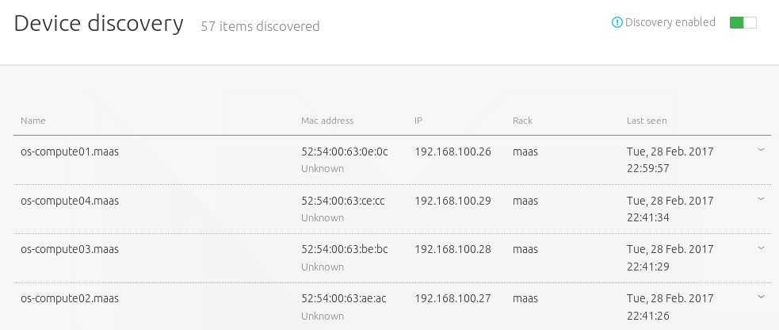
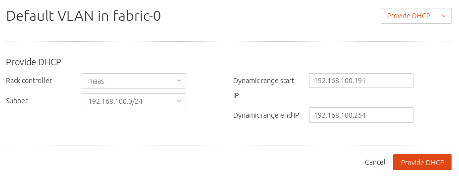
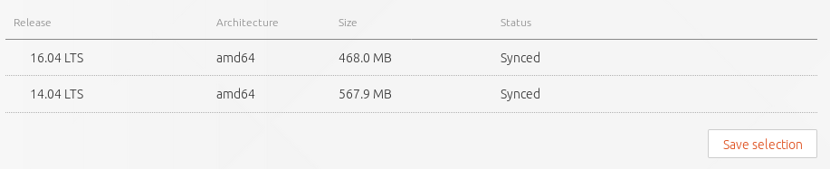

Install MAAS
============

`MAAS <https://maas.io/>`__, *Metal As A Service*, brings cloud convenience to
your hardware, enabling pools of physical servers to be controlled just like
virtual machines in the cloud.

On its own, MAAS can perform zero-touch deployments of `Windows, Ubuntu, CentOS,
RHEL and SUSE <https://maas.io/#pricing>`__. But in combination with
`Juju <https://jujucharms.com/about>`__, complex environments can be modelled
and deployed, pulled down and redeployed again, easily and entirely abstracted
from your underlying infrastructure.

We're going to use MAAS as the foundation for Juju to deploy a fully fledged
OpenStack cloud.

The following is what you'll find in a typical MAAS environment and we'll use
this as the framework for our own deployment:

-  A **Region controller** interacts with and controls the wider environment for
   a region
-  One or more **Rack controllers** manage locally grouped hardware, usually
   within a data centre rack
-  Multiple **Nodes** are individual machines managed by the Rack controller,
   and ultimately, the Region controller
-  Complex **Networking** topologies can be modelled and implemented by MAAS,
   from a single fabric to multiple zones and many overlapping spaces

What you'll need
----------------

MAAS can work at any scale, from a test deployment using a handful of machines
to thousands of machines deployed across multiple regions.

It's our intention to build a useful minimal deployment of OpenStack, capable of
both performing some real work and scaling to fit more ambitious projects.

To make this minimal configuration as accessible as possible, we'll be using
single nodes for multiple services, reducing the total number of machines
required. The four cloud nodes, for instance, will co-host Ceph, Glance and
Swift, as well as the other services required by OpenStack.

The hardware we'll be using is based on the following specifications:

-  1 x MAAS Rack with Region controller: 8GB RAM, 2 CPUs, 1 NIC, 40GB storage
-  1 x Juju node: 4GB RAM, 2 CPUs, 1 NIC, 40GB storage
-  4 x OpenStack cloud nodes: 8GB RAM, 2 CPUs, 2 NICs, 80GB storage

To get a better idea of the minimum requirements for the machines that run MAAS,
take a look at the `MAAS
documentation <https://docs.ubuntu.com/maas/2.2/en/#minimum-requirements>`__.

As with the hardware, our network topology is also going to be as simple as
possible whilst remaining both scaleable and functional. It contains a single
zone for the four cloud nodes, with the machine hosting the MAAS region and rack
controllers connected to both the external network and the single zone. It's
recommended that MAAS is the sole provider of DHCP and DNS for the network
hosting the nodes MAAS is going to manage, but we'll cover this in an imminent
step.

Your hardware could differ considerably from the above and both MAAS and Juju
will easily adapt. The Juju node could operate perfectly adequately with half
the RAM (this would need to be defined as a bootstrap constraint) and adding
more nodes will obviously improve performance.

.. note:: We'll be using the web UI whenever possible, but it's worth noting
   that everything (and more) we do with MAAS can also be done from the
   `CLI <https://docs.ubuntu.com/maas/2.2/en/manage-cli>`__ and the
   `API <https://docs.ubuntu.com/maas/2.2/en/api>`__.

Package installation
--------------------

The first step is to install `Ubuntu Server 16.04
LTS <https://www.ubuntu.com/download/server>`__ on the machine that's going to
host both the MAAS Rack and Region controllers. The Ubuntu Server install menu
includes the option to `Install and configure both
controllers <https://docs.ubuntu.com/maas/2.1/en/installconfig-iso-install>`__,
but to cover more use cases, we will assume that you have a fresh install of
Ubuntu Server.

The network configuration for your new server will depend on your own
infrastructure. In our example, the MAAS server network interface connects to
the wider network through ``192.168.100.0/24``. These options can be configured
during installation. See the Ubuntu Server `Network Configuration
documentation <https://help.ubuntu.com/lts/serverguide/network-configuration.html>`__
for further details on modifying your network configuration.

To update the package database and install MAAS, issue the following commands:

.. code:: bash

    sudo apt update
    sudo apt install maas

At this point, MAAS is now running, albeit without a meaningful configuration.
You can check this by pointing a web browser at
``http://<your.maas.ip>:5240/MAAS/``. You will see a page complaining that no
admin user has been created yet.

A MAAS admin account is needed before we can start configuring MAAS. This needs
to be done on the command line by typing the following:

.. code:: bash

    sudo maas createadmin

You'll be asked for a username, a password and an email address. The following
text will assume ``admin`` was used as the username.

.. note:: MAAS does not currently make use of the email address.

A final question will ask whether you want to import SSH keys. MAAS uses the
public SSH key of a user to manage and secure access to deployed nodes, just as
you might with managed servers or remote machines. Press ``Enter`` to skip this
as we'll do this from the web UI in the next step.

On-boarding
-----------

Now we've created an admin account, the web interface will update to ask for
login credentials. With credentials successfully accepted, the web interface
will launch the 'Welcome to MAAS' on-boarding page:

   welcome to maas

This is the first page of two that will step through the final steps necessary
for MAAS to get up and running. Unless you have specific requirements, most of
these options can be left at their default values:

-  **Connectivity**: important services that default to being outside of your
   network. These include package archives and the DNS forwarder.

-  **Ubuntu**: this section refers to the versions and architectures of the
   Ubuntu images MAAS will import and use on deployed nodes. Select
   ``14.04 LTS`` alongside ``16.04 LTS`` as an add an additional image.

   Ubuntu images

-  **Keys**: You can conveniently import your public SSH key(s) from both
   Launchpad and Github by entering your user id for these services. To add a
   local public key file, usually ``HOME/ssh/id_rsa.pub``, select ``Upload`` and
   paste file contents into the box that appears. Click ``Import`` to fix the
   setting.

   SSH key import

If you need to generate a local SSH public/private key pair, type
``ssh-keygen -t rsa`` from the Linux account you'll control MAAS from, and when
asked, leave the passphrase blank.

Adding SSH keys completes this initial MAAS configuration. Click
``Go to the dashboard`` to move to the MAAS dashboard and the device discovery
process

Networking
----------

By default, MAAS will monitor local network traffic and report any devices it
discovers on the 'Device discovery' page of the web UI. This page also functions
as the landing page for the dashboard and will be the first one you see
progressing from the installation on-boarding.

   Device discovery

Before taking the configuration further, we need to tell MAAS about our network
and how we'd like connections to be configured.

These options are managed from the ``Subnets`` page of the web UI. The subnets
page defaults to listing connections by fabric and MAAS creates one fabric per
physical NIC on the MAAS server. As we're configuring a machine with a single
NIC, a single fabric will be listed linked to the external subnet.

We need to add DHCP to the subnet that's going to manage the nodes. To do this,
select the ``untagged`` VLAN the subnet to the right of ``fabric-0``.

The page that appears will be labelled something similar to
``Default VLAN in fabric-0``. From here, click on the ``Take action`` button in
the top right and select ``Provide DHCP``. A new pane will appear that allows
you to specify the start and end IP addresses for the DHCP range. Select
``Provide DHCP`` to accept the default values. The VLAN summary should now show
DHCP as ``Enabled``.

   Provide DHCP

.. note:: See `Concepts and
   Terms <https://docs.ubuntu.com/maas/2.1/en/intro-concepts>`__ in the MAAS
   documentation for clarification on the terminology used within MAAS.

Images
------

We have already downloaded the images we need as part of the on-boarding
process, but it's worth checking that both the images we requested are
available. To do this, select the 'Images' page from the top menu of the web UI.

The ``Images`` page allows you to download new images, use a custom source for
images, and check on the status of any images currently downloaded. These appear
at the bottom, and both 16.04 LTS and 14.04 LTS should be listed with a status
of ``Synced``.

   Image status

Adding nodes
------------

MAAS is now ready to accept new nodes. To do this, first ensure your four cloud
nodes and single Juju node are set to boot from a PXE image. Now simply power
them on. MAAS will add these new nodes automatically by taking the following
steps:

-  Detect each new node on the network
-  Probe and log each node's hardware (using an ephemeral boot image)
-  Add each node to the ``Nodes`` page with a status of ``New``

Though less satisfying, we'd recommend powering up each node one at a time, as
it can be difficult to know which is which at this stage.

In order to fully manage a deployment, MAAS needs to be able power cycle each
node. This is why MAAS will attempt to power each node off during the discovery
phase. If your hardware does not power off, it's likely that it's not using an
IPMI based BMC and you will need to edit a node's power configuration to enable
MAAS to control its power. See the `MAAS
documentation <https://docs.ubuntu.com/maas/2.2/en/installconfig-nodes-power-types>`__
for more information on power types, including a
`table <https://docs.ubuntu.com/maas/2.2/en/installconfig-nodes-power-types#bmc-driver-support>`__
showing a feature comparison for the supported BMC drivers.

To edit a node's power configuration, click on the arbitrary name your machine
has been given in the ``Nodes`` page. This will open the configuration page for
that specific machine. ``Power`` is the second section from the top.

Use the drop-down ``Power type`` menu to open the configuration options for your
node's specific power configuration and enter any further details that the
configuration may require.

.. figure:: ./media/install-maas_power.png
   :alt: Power configuration

   Power configuration

Click ``Save changes`` when finished. You should now be able to power off the
machine using the ``Take action`` menu in the top right.

Commission nodes
----------------

From the ``Nodes`` page, select all the check boxes for all the machines in a
``New`` state and use the ``Take action`` menu to select ``Commission``. After a
few minutes, successfully commissioned nodes will change their status to
``Ready``. The CPU cores, RAM, number of drives and storage fields should now
correctly reflect the hardware on each node.

For more information on the different states and actions for a node, see `Node
actions <https://docs.ubuntu.com/maas/2.1/en/intro-concepts#node-actions>`__ in
the MAAS documentation.

We're now almost at the stage where we can let Juju do its thing. But before we
take that next step, we're going to rename and ``tag`` the newly added nodes so
that we can instruct Juju which machines to use for which purpose.

To change the name of a node, select it from the ``Nodes`` page and use the
editable name field in the top right. All nodes will automatically be suffixed
with ``.maas``. Click on ``Save`` to fix the change.

Tags are normally used to identify nodes with specific hardware, such GPUs for
GPU-accelerated CUDA processing. This allows Juju to target these capabilities
when deploying applications that may use them. But they can also be used for
organisational and management purposes. This is how we're going to use them, by
adding a ``compute`` tag to the four cloud nodes and a ``juju`` tag to the node
that will act as the Juju controller.

Tags are added from the ``Machine summary`` section of the same individual node
page we used to rename a node. Click ``Edit`` on this section and look for
``Tags``. A tag is added by entering a name for the tag in the empty field and
clicking ``Save changes``.

.. figure:: ./media/install-maas_tags.png
   :alt: Adding tags

   Adding tags

Here's a summary of the status of each node we've now added to MAAS, showing
their names and tags alongside each node's hardware configuration:

+---------------------+-----------+--------+-------+----------+-----------+
| Node name           | Tag(s)    | CPUs   | RAM   | Drives   | Storage   |
+=====================+===========+========+=======+==========+===========+
| os-compute01.maas   | compute   | 2      | 6.0   | 3        | 85.9      |
+---------------------+-----------+--------+-------+----------+-----------+
| os-compute02.maas   | compute   | 2      | 6.0   | 3        | 85.9      |
+---------------------+-----------+--------+-------+----------+-----------+
| os-compute03.maas   | compute   | 2      | 6.0   | 3        | 85.9      |
+---------------------+-----------+--------+-------+----------+-----------+
| os-compute04.maas   | compute   | 2      | 6.0   | 3        | 85.9      |
+---------------------+-----------+--------+-------+----------+-----------+
| os-juju01.maas      | juju      | 2      | 4.0   | 1        | 42.9      |
+---------------------+-----------+--------+-------+----------+-----------+

Next steps
----------

Everything is now configured and ready for our next step. This will involve
deploying the Juju controller onto its own node. From there, we'll be using Juju
and MAAS together to deploy OpenStack into the four remaining cloud nodes.

.. raw:: html

   <!-- LINKS -->

.. raw:: html

   <!-- IMAGES -->
