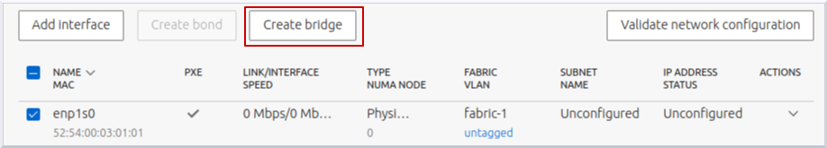
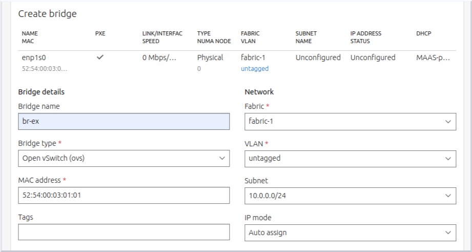

============
Install MAAS
============

In the :doc:`previous section <install-overview>`, we gave a summary of the
OpenStack cloud we'll be building and described the approach we'll take for
doing that.

This page will cover the installation of `MAAS`_ as well as point out what is
required out of MAAS in terms of post-installation tasks. The goal is to
achieve a network topology that is both simple yet scalable and functional.

.. note::

   This document refers to the MAAS web UI for management purposes, but all
   tasks can equally be done via the `CLI`_ or the `API`_.

Requirements
------------

The entire environment will consist of a single MAAS system with five nodes.
This MAAS cluster will contain a single zone, with the MAAS system (region and
rack controllers) connected to both the external network and the single zone.

Here are the hardware requirements:

* 1 x MAAS system: 8GiB RAM, 2 CPUs, 1 NIC, 1 x 40GiB storage
* 1 x Juju controller node: 4GiB RAM, 2 CPUs, 1 NIC, 1 x 40GiB storage
* 4 x cloud nodes: 8GiB RAM, 2 CPUs, 1 NIC, 3 x 80GiB storage

.. note::

   The legacy requirement for two network interfaces on each of the four cloud
   nodes has been dropped since MAAS (v.2.9.2) added support for `Open
   vSwitch`_ bridges. This bridge type supports more sophisticated network
   topologies than the Linux Bridge, and for Charmed OpenStack in particular,
   the ovn-chassis unit no longer needs a dedicated network device.

See `MAAS requirements`_ in the MAAS documentation for more detailed
information on what a MAAS system may require.

It is assumed that all six systems are physical in nature. Although not a
requirement, the Juju and cloud nodes used here are of the AMD64 architecture
type.

.. note::

   A full MAAS deployed OpenStack environment can be deployed for test
   environments using virtual machines. In such a case, nested virtualisation
   should be enabled on the hosts running the virtual machines which make up
   the infrastructure.

MAAS is also considered to be the sole provider of DHCP and DNS for the network
hosting the MAAS cluster.

The MAAS system's single network interface resides on subnet
**10.0.0.0/24** and the system itself has an assigned IP address of
**10.0.0.2**.

.. attention::

   The MAAS-provisioned nodes rely upon Jammy AMD64 images provided by MAAS.

.. _install_maas:

Install MAAS
------------

Here is a concise summary of how to install and initialise MAAS on the
designated system but make sure to consult the official `MAAS installation
instructions`_ for details:

.. code-block:: none

   sudo snap install maas-test-db
   sudo snap install maas --channel=3.1/stable
   sudo maas init region+rack --maas-url http://10.0.0.2:5240/MAAS --database-uri maas-test-db:///
   sudo maas createadmin --username admin --password ubuntu --email admin@example.com --ssh-import lp:<unsername>
   sudo maas apikey --username admin > ~ubuntu/admin-api-key

See :command:`maas init --help` for details.

Notes:

* The :command:`maas init` command cannot be invoked a second time.
* MAAS does not currently make use of the email address supplied to the
  :command:`maas createadmin` command.
* The last command puts a copy of the API key for user 'admin' in a file. We'll
  need this information on the next page.

.. note::

   See `Concepts and terms`_ in the MAAS documentation for clarification on the
   terminology used within MAAS.

Post installation tasks
-----------------------

There are a number of tasks to complete once the MAAS system is installed.

Web UI and on-boarding
~~~~~~~~~~~~~~~~~~~~~~

Based on the previous command invocations, the credentials of the newly created
MAAS administrator are:

| Username: **admin**
| Password: **ubuntu**
|

In this example, the address of the MAAS system is 10.0.0.2.

The web UI URL then becomes:

**http://10.0.0.2:5240/MAAS**

You will be whisked through an on-boarding process when you access the web UI
for the first time. Recall that we require 22.04 LTS AMD64 images.

Enable DHCP
~~~~~~~~~~~

DHCP must be enabled on the VLAN that affects the subnet where the five nodes
reside. See `Handling DHCP`_ in the MAAS documentation for guidance.

Verify images
~~~~~~~~~~~~~

The on-boarding process should have taken care of the image downloads. Verify
this by visiting the **Images** page in the web UI.

Check MAAS health
~~~~~~~~~~~~~~~~~

Confirm the health of the MAAS system by visiting the **Controllers** page in
the web UI. Select the controller name and ensure that the resulting page shows
a green checkmark alongside items 'regiond' through 'dhcpd'.

Add nodes
~~~~~~~~~

Add the five nodes to the MAAS cluster by "netbooting" them (PXE boot). MAAS
will proceed to *enlist* them. Once the process is complete the nodes will be
listed on the **Machines** page with a status of 'New'.

Allowing a node to show up in the web UI before booting another one will make
it clear which hardware node maps to which MAAS node. Tracking by MAC address
will eliminate this concern.

.. important::

   A MAAS node should always remain configured to netboot. MAAS will manage the
   booting of its cluster members.

Configure node power type
~~~~~~~~~~~~~~~~~~~~~~~~~

MAAS must have the ability to power cycle each of its nodes. See `BMC power
types`_ in the MAAS documentation for how to configure your nodes' power type.

Commission nodes
~~~~~~~~~~~~~~~~

Commission the five nodes by selecting them on the **Machines** page, using the
green **Take action** button, and choosing 'Commission'. Successfully
commissioned nodes gain a status of 'Ready'. This will take a few minutes.

For the full list of node statuses and node actions, see `Concepts and terms`_
in the MAAS documentation.

Rename nodes
~~~~~~~~~~~~

Rename the newly commissioned nodes to something more appealing or meaningful.

To change the name of a node, select it from the **Machines** page and use the
name field in the top-left. Here we've used 'node1' through 'node4' for the
four cloud nodes and 'controller' for the Juju controller node.

.. note::

   All nodes will automatically be suffixed with the string '.maas'.

.. _tag_nodes:

Tag nodes
~~~~~~~~~

MAAS tags will be used to help organise and manage the five nodes.

Tags are added on the ``Configuration`` tab of the same individual node page
used to rename a node. Add tag 'compute' to the four cloud nodes and tag 'juju'
to the Juju controller node.

See `MAAS tags`_ in the MAAS documentation for a full understanding of tags.

.. _ovs_bridge:

Create OVS bridge
~~~~~~~~~~~~~~~~~

Create an Open vSwitch bridge from a network bond or a single interface. Here
we will do the latter with interface 'enp1s0':

.. role:: raw-html(raw)
    :format: html

:raw-html:` `

The bridge will be named 'br-ex':

.. role:: raw-html(raw)
    :format: html

:raw-html:` `

Multiple VLANs can be added to the bridge but in this example cloud a single
untagged VLAN is used.

Configure all four cloud nodes in this way to ensure that the OVN Chassis can
be accommodated by any node.

The mapping of bridge to interface ('br-ex:enp1s0') will be used in the
:ref:`Neutron networking <neutron_networking>` section on the :doc:`Install
OpenStack <install-openstack>` page.

Node summary
------------

Here's a summary of the five MAAS nodes:

+-----------------+-----------+------+------+-----+-------+---------+
| Node name       | Tag(s)    | CPUs | NICs | RAM | Disks | Storage |
+=================+===========+======+======+=====+=======+=========+
| node1.maas      | compute   | 2    | 1    | 8.0 | 3     | 80.0    |
+-----------------+-----------+------+------+-----+-------+---------+
| node2.maas      | compute   | 2    | 1    | 8.0 | 3     | 80.0    |
+-----------------+-----------+------+------+-----+-------+---------+
| node3.maas      | compute   | 2    | 1    | 8.0 | 3     | 80.0    |
+-----------------+-----------+------+------+-----+-------+---------+
| node4.maas      | compute   | 2    | 1    | 8.0 | 3     | 80.0    |
+-----------------+-----------+------+------+-----+-------+---------+
| controller.maas | juju      | 2    | 1    | 4.0 | 1     | 40.0    |
+-----------------+-----------+------+------+-----+-------+---------+

Next steps
----------

The next step is to create a Juju controller. This will involve deploying
Ubuntu and Juju software onto the designated node. Go to :doc:`Install Juju
<install-juju>` now.

.. LINKS
.. _CLI: https://maas.io/docs/maas-cli
.. _API: https://maas.io/docs/api
.. _MAAS: https://maas.io
.. _MAAS requirements: https://maas.io/docs/snap/2.9/cli/maas-requirements
.. _MAAS installation instructions: https://maas.io/docs/install-from-a-snap
.. _Concepts and terms: https://maas.io/docs/concepts-and-terms
.. _Handling DHCP: https://maas.io/docs/dhcp
.. _BMC power types: https://maas.io/docs/bmc-power-types
.. _MAAS tags: https://maas.io/docs/tags
.. _Open vSwitch: https://docs.openvswitch.org/en/latest/intro/what-is-ovs/
