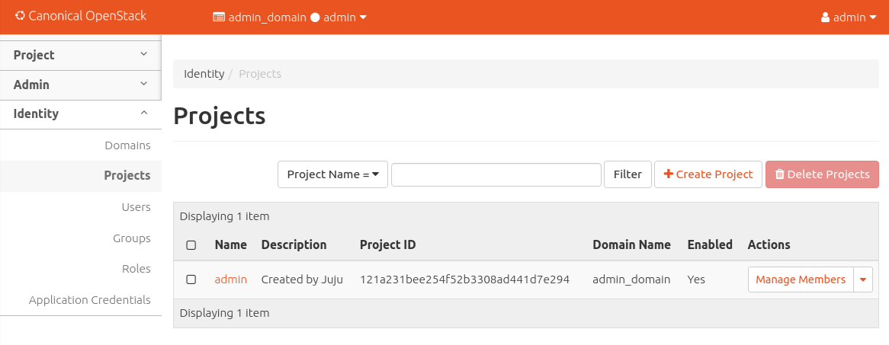

Install OpenStack
=================

Now that we've installed and configured `MAAS <./install-maas.html>`__ and
successfully deployed a `Juju <./install-juju.html>`__ controller, it's time to
do some real work; use Juju to deploy
`OpenStack <https://www.openstack.org/>`__, the leading open cloud platform.

We have two options when installing OpenStack.

1. Install and configure each OpenStack component separately. Adding Ceph,
   Compute, Swift, RabbitMQ, Keystone and Neutron in this way allows you to see
   exactly what Juju and MAAS are doing, and consequently, gives you a better
   understanding of the underlying OpenStack deployment.
2. Use a `bundle <https://jujucharms.com/docs/stable/charms-bundles>`__ to
   deploy OpenStack with a single command. A bundle is an encapsulation of a
   working deployment, including all configuration, resources and references. It
   allows you to effortlessly recreate a deployment with a single command or
   share that deployment with other Juju users.

If this is your first foray into MAAS, Juju and OpenStack territory, we'd
recommend starting with the first option. This will give you a stronger
foundation for maintaining and expanding the default deployment. Our
instructions for this option continue below.

Alternatively, jump to `Deploying OpenStack as a
bundle <./install-openstack-bundle.html>`__ to learn about deploying as a
bundle.

Deploy the Juju controller
--------------------------

`Previously <./install-juju.html>`__, we tested our MAAS and Juju configuration
by deploying a new Juju controller called ``maas-controller``. You can check
this controller is still operational by typing ``juju status``. With the Juju
controller running, the output will look similar to the following:

.. code:: bash

    Model    Controller           Cloud/Region  Version
    default  maas-controller-two  mymaas        2.2.1

    App  Version  Status  Scale  Charm  Store  Rev  OS  Notes

    Unit  Workload  Agent  Machine  Public address  Ports  Message

    Machine  State  DNS  Inst id  Series  AZ

If you need to remove and redeploy the controller, use the following two
commands:

.. code:: bash

    juju kill-controller maas-controller
    juju bootstrap --constraints tags=juju maas maas-controller

During the bootstrap process, Juju will create a model called ``default``, as
shown in the output from ``juju status`` above.
`Models <https://jujucharms.com/docs/stable/models>`__ act as containers for
applications, and Juju's default model is great for experimentation.

We're going to create a new model called ``uos`` to hold our OpenStack
deployment exclusively, making the entire deployment easier to manage and
maintain.

To create a model called ``uos`` (and switch to it), simply type the following:

.. code:: bash

    juju add-model uos

Deploy OpenStack
----------------

We're now going to step through adding each of the various OpenStack components
to the new model. Each application will be installed from the `Charm
store <https://jujucharms.com>`__. We'll be providing the configuration for many
of the charms as a ``yaml`` file which we include as we deploy them.

`Ceph OSD <https://jujucharms.com/ceph-osd>`__
~~~~~~~~~~~~~~~~~~~~~~~~~~~~~~~~~~~~~~~~~~~~~~

We're starting with the Ceph object storage daemon and we want to configure Ceph
to use the second drive of a cloud node, ``/dev/sdb``. Change or ignore this to
match your own configuration. The configuration is held within the following
file we've called ``ceph-osd.yaml``:

.. code:: yaml

    ceph-osd:
      osd-devices: /dev/sdb
      osd-reformat: "yes"

We're going to deploy Ceph-OSD to each of the four cloud nodes we've already
tagged with ``compute``. The following command will import the settings above
and deploy Ceph-OSD to each of the four nodes:

.. code:: bash

    juju deploy --constraints tags=compute --config ceph-osd.yaml -n 4 ceph-osd

In the background, Juju will ask MAAS to commission the nodes, powering them on
and installing Ubuntu. Juju then takes over and installs the necessary packages
for the required application.

Remember, you can check on the status of a deployment using the ``juju status``
command. To see the status of a single charm of application, append the charm
name:

.. code:: bash

    juju status ceph-osd

In this early stage of deployment, the output will look similar to the
following:

.. code:: bash

    Model  Controller       Cloud/Region  Version
    uoa    maas-controller  mymaas        2.2-beta1

    App       Version  Status   Scale  Charm     Store       Rev  OS      Notes
    ceph-osd  10.2.6   blocked      4  ceph-osd  jujucharms  241  ubuntu

    Unit         Workload  Agent  Machine  Public address   Ports  Message
    ceph-osd/0   blocked   idle   0        192.168.100.113         Missing relation: monitor
    ceph-osd/1*  blocked   idle   1        192.168.100.114         Missing relation: monitor
    ceph-osd/2   blocked   idle   2        192.168.100.115         Missing relation: monitor
    ceph-osd/3   blocked   idle   3        192.168.100.112         Missing relation: monitor

    Machine  State    DNS              Inst id  Series  AZ       Message
    0        started  192.168.100.113  fr36gt   xenial  default  Deployed
    1        started  192.168.100.114  nnpab4   xenial  default  Deployed
    2        started  192.168.100.115  a83gcy   xenial  default  Deployed
    3        started  192.168.100.112  7gan3t   xenial  default  Deployed

Don't worry about the 'Missing relation' messages. We'll add the required
relations in a later step. You also don't have to wait for a deployment to
finish before adding further applications to Juju. Errors will resolve
themselves as applications are deployed and dependencies are met.

`Nova Compute <https://jujucharms.com/nova-compute/>`__
~~~~~~~~~~~~~~~~~~~~~~~~~~~~~~~~~~~~~~~~~~~~~~~~~~~~~~~

We're going use three machines to host the OpenStack Nova Compute application.
The first will use the following configuration file, ``compute.yaml``, while
we'll use the second and third to scale-out the same application to two other
machines.

.. code:: yaml

    nova-compute:
      enable-live-migration: True
      enable-resize: True
      migration-auth-type: ssh
      virt-type: qemu

Type the following to deploy ``nova-compute`` to machine number 1:

.. code:: bash

    juju deploy --to 1 --config compute.yaml nova-compute

And use the following commands to scale-out Nova Compute to machines 2 and 3:

.. code:: bash

    juju add-unit --to 2 nova-compute
    juju add-unit --to 3 nova-compute

As before, it's worth checking ``juju status nova-compute`` output to make sure
``nova-compute`` has been deployed to three machines. Look for lines similar to
these:

.. code:: bash

    Machine  State    DNS              Inst id  Series  AZ       Message
    1        started  192.168.100.117  7gan3t   xenial  default  Deployed
    2        started  192.168.100.118  fr36gt   xenial  default  Deployed
    3        started  192.168.100.119  nnpab4   xenial  default  Deployed

`Swift storage <https://jujucharms.com/swift-storage/>`__
~~~~~~~~~~~~~~~~~~~~~~~~~~~~~~~~~~~~~~~~~~~~~~~~~~~~~~~~~

The Swift-storage application is going to be deployed to the first machine
(``machine 0``), and scaled across the other three with the following
configuration file:

.. code:: bash

    swift-storage:
      block-device: sdc
      overwrite: "true"

Here are the four deploy commands for the four machines:

.. code:: bash

    juju deploy --to 0 --config swift-storage.yaml swift-storage
    juju add-unit --to 1 swift-storage
    juju add-unit --to 2 swift-storage
    juju add-unit --to 3 swift-storage

`Neutron networking <https://jujucharms.com/neutron-api/>`__
~~~~~~~~~~~~~~~~~~~~~~~~~~~~~~~~~~~~~~~~~~~~~~~~~~~~~~~~~~~~

Next comes Neutron for OpenStack networking. We have just a couple of
configuration options than need to be placed within ``neuton.yaml`` and we're
going to use this for two applications, ``neutron-gateway`` and ``neutron-api``:

.. code:: yaml

    neutron-gateway:
      ext-port: 'eth1'
    neutron-api:
      neutron-security-groups: True

First, deploy the gateway:

.. code:: bash

    juju deploy --to 0 --config neutron.yaml neutron-gateway

We're going to colocate the Neutron API on machine 1 by using an
`LXD <https://www.ubuntu.com/containers/lxd>`__ container. This is a great
solution for both local deployment and for managing cloud instances.

We'll also deploy Neutron OpenvSwitch:

.. code:: bash

    juju deploy --to lxd:1 --config neutron.yaml neutron-api
    juju deploy neutron-openvswitch

We've got to a stage where we can start to connect applications together. Juju's
ability to add these links, known as a relation in Juju, is one of its best
features.

See `Managing
relationships <https://jujucharms.com/docs/stable/charms-relations>`__ in the
Juju documentation for more information on relations.

Add the network relations with the following commands:

.. code:: bash

    juju add-relation neutron-api neutron-gateway
    juju add-relation neutron-api neutron-openvswitch
    juju add-relation neutron-openvswitch nova-compute

There are still 'Missing relations' messages in the status output, leading to
the status of some applications to be ``blocked``. This is because there are
many more relations to be added but they'll resolve themselves automatically as
we add them.

`Percona cluster <https://jujucharms.com/percona-cluster/>`__
~~~~~~~~~~~~~~~~~~~~~~~~~~~~~~~~~~~~~~~~~~~~~~~~~~~~~~~~~~~~~

The Percona XtraDB cluster application comes next, and like Neutron API above,
we're going to use LXD.

The following ``mysql.yaml`` is the only configuration we need:

.. code:: yaml

    mysql:
      max-connections: 20000

To deploy Percona alongside MySQL:

.. code:: bash

    juju deploy --to lxd:0 --config mysql.yaml percona-cluster mysql

And there's just a single new relation to add:

.. code:: bash

    juju add-relation neutron-api mysql

`Keystone <https://jujucharms.com/keystone/>`__
~~~~~~~~~~~~~~~~~~~~~~~~~~~~~~~~~~~~~~~~~~~~~~~

As Keystone handles OpenStack identity management and access, we're going to use
the following contents of ``keystone.yaml`` to set an admin password for
OpenStack:

.. code:: yaml

    keystone:
      admin-password: openstack

We'll use an LXD container on machine 3 to help balance the load a little. To
deploy the application, use the following command:

.. code:: bash

    juju deploy --to lxd:3 --config keystone.yaml keystone

Then add these relations:

.. code:: bash

    juju add-relation keystone mysql
    juju add-relation neutron-api keystone

`RabbitMQ <https://jujucharms.com/rabbitmq-server/>`__
~~~~~~~~~~~~~~~~~~~~~~~~~~~~~~~~~~~~~~~~~~~~~~~~~~~~~~

We're using RabbitMQ as the messaging server. Deployment requires no further
configuration than running the following command:

.. code:: bash

    juju deploy --to lxd:0 rabbitmq-server

This brings along four new connections that need to be made:

.. code:: bash

    juju add-relation neutron-api rabbitmq-server
    juju add-relation neutron-openvswitch rabbitmq-server
    juju add-relation nova-compute:amqp rabbitmq-server
    juju add-relation neutron-gateway:amqp rabbitmq-server:amqp

`Nova Cloud Controller <https://jujucharms.com/nova-cloud-controller/>`__
~~~~~~~~~~~~~~~~~~~~~~~~~~~~~~~~~~~~~~~~~~~~~~~~~~~~~~~~~~~~~~~~~~~~~~~~~

This is the controller service for OpenStack, and includes the nova-scheduler,
nova-api and nova-conductor services.

The following simple ``controller.yaml`` configuration file will be used:

.. code:: yaml

    nova-cloud-controller:
      network-manager: "Neutron"

To add the controller to your deployment, enter the following:

.. code:: bash

    juju deploy --to lxd:2 --config controller.yaml nova-cloud-controller

Followed by these ``add-relation`` connections:

.. code:: bash

    juju add-relation nova-cloud-controller mysql
    juju add-relation nova-cloud-controller keystone
    juju add-relation nova-cloud-controller rabbitmq-server
    juju add-relation nova-cloud-controller neutron-gateway
    juju add-relation neutron-api nova-cloud-controller
    juju add-relation nova-compute nova-cloud-controller

`OpenStack Dashboard <https://jujucharms.com/openstack-dashboard/>`__
~~~~~~~~~~~~~~~~~~~~~~~~~~~~~~~~~~~~~~~~~~~~~~~~~~~~~~~~~~~~~~~~~~~~~

We'll deploy the dashboard to another LXD container with a single command:

.. code:: bash

    juju deploy --to lxd:3 openstack-dashboard

And a single relation:

.. code:: bash

    juju add-relation openstack-dashboard keystone

`Glance <https://jujucharms.com/glance/>`__
~~~~~~~~~~~~~~~~~~~~~~~~~~~~~~~~~~~~~~~~~~~

For the Glance image service, deploy as follows:

.. code:: bash

    juju deploy --to lxd:2 glance

Relations:

.. code:: bash

    juju add-relation nova-cloud-controller glance
    juju add-relation nova-compute glance
    juju add-relation glance mysql
    juju add-relation glance keystone
    juju add-relation glance rabbitmq-server

`Ceph monitor <https://jujucharms.com/ceph-mon/>`__
~~~~~~~~~~~~~~~~~~~~~~~~~~~~~~~~~~~~~~~~~~~~~~~

For Ceph monitors (which monitor the topology of the Ceph deployment and
manage the CRUSH map which is used by clients to read and write data) no
additional configuration over the defaults provided is required, so
deploy three units with this:

.. code:: bash

    juju deploy --to lxd:1 ceph-mon
    juju add-unit --to lxd:2 ceph-mon
    juju add-unit --to lxd:3 ceph-mon

With these additional relations:

.. code:: bash

    juju add-relation ceph-osd ceph-mon
    juju add-relation nova-compute ceph-mon
    juju add-relation glance ceph-mon

`Cinder <https://jujucharms.com/cinder/>`__
~~~~~~~~~~~~~~~~~~~~~~~~~~~~~~~~~~~~~~~~~~~

For Cinder block storage, use the following ``cinder.yaml`` file:

.. code:: yaml

    cinder:
      glance-api-version: 2
      block-device: None

And deploy with this:

.. code:: bash

    juju deploy --to lxd:1 --config cinder.yaml cinder

Relations:

.. code:: bash

    juju add-relation nova-cloud-controller cinder
    juju add-relation cinder mysql
    juju add-relation cinder keystone
    juju add-relation cinder rabbitmq-server
    juju add-relation cinder:image-service glance:image-service
    juju add-relation cinder ceph-mon

`Swift proxy <https://jujucharms.com/swift-proxy/>`__
~~~~~~~~~~~~~~~~~~~~~~~~~~~~~~~~~~~~~~~~~~~~~~~~~~~~~

Swift also needs a unique identifier, best generated with the ``uuid`` command
used previously. The output UUID is used for the ``swift-hash`` value in the
``swift-proxy.yaml`` configuration file:

.. code:: yaml

    swift-proxy:
      zone-assignment: auto
      swift-hash: "a1ee9afe-194c-11e7-bf0f-53d662bc4339"

Use the following command to deploy:

.. code:: bash

    juju deploy --to lxd:0 --config swift-proxy.yaml swift-proxy

These are its two relations:

.. code:: bash

    juju add-relation swift-proxy swift-storage
    juju add-relation swift-proxy keystone

`NTP <https://jujucharms.com/ntp/>`__
~~~~~~~~~~~~~~~~~~~~~~~~~~~~~~~~~~~~~

The final component we need to deploy is a Network Time Protocol client, to keep
everything in time. This is added with the following simple command:

.. code:: bash

    juju deploy ntp

These last few ``add-relation`` commands finish all the connections we need to
make:

.. code:: bash

    juju add-relation neutron-gateway ntp
    juju add-relation ceph-osd ntp

All that's now left to do is wait on the output from ``juju status`` to show
when everything is ready (everything turns green, if your terminal support
colour).

Test OpenStack
--------------

After everything has deployed and the output of ``juju status`` settles, you can
check to make sure OpenStack is working by logging into the Horizon dashboard.

The quickest way to get the IP address for the dashboard is with the following
command:

.. code:: bash

    juju status --format=yaml openstack-dashboard | grep public-address | awk '{print $2}'

The URL will be ``http://<IP ADDRESS>/horizon``. When you enter this into your
browser you can login with ``admin`` and ``openstack``, unless you changed the
password in the configuration file.

If everything works, you will see something similar to the following:

   Horizon dashboard

Next steps
----------

Congratulations, you've successfully deployed a working OpenStack environment
using both Juju and MAAS. The next step is to `configure
OpenStack <./config-openstack.html>`__ for use within a production environment.

.. raw:: html

   <!-- LINKS -->

.. raw:: html

   <!-- IMAGES -->
