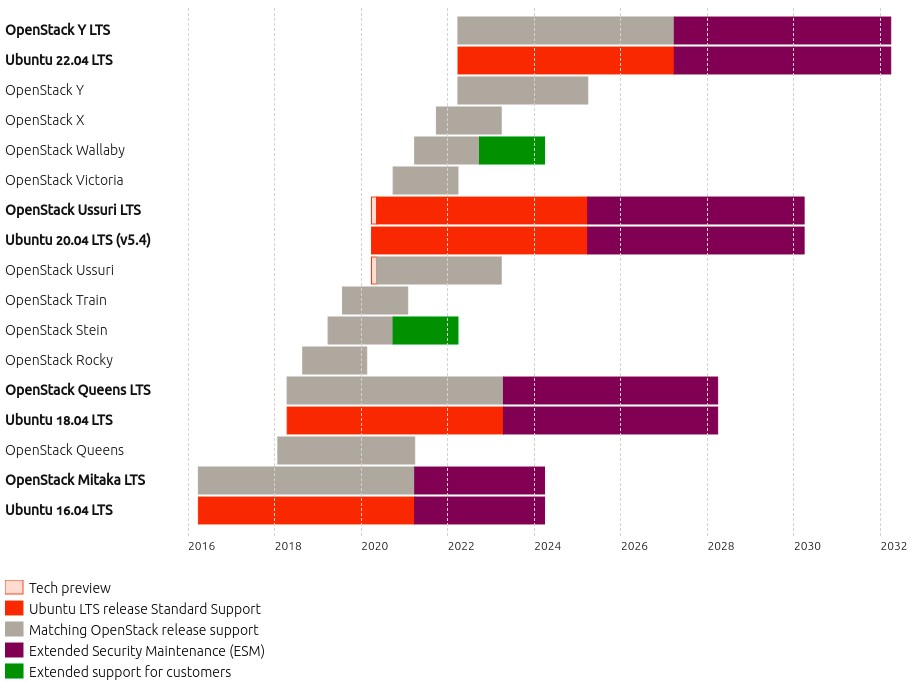

=================
Upgrades overview
=================

This page provides an overview of how various components of a Charmed OpenStack
deployment are upgraded. The upgrade of each of these components are distinct
operations and are referred to as separate upgrade types. They are defined in
this way:

Charms upgrade
  An upgrade of the charms that are used to deploy and manage Charmed
  OpenStack. This includes charms that manage applications which are not
  technically part of the OpenStack project such as Ceph, RabbitMQ, and Vault.

OpenStack upgrade
  An upgrade of the software deployed by the OpenStack charms. Each application
  is upgraded via its corresponding charm. This constitutes an upgrade from one
  major OpenStack version to the next (e.g. Ussuri to Victoria).

Series upgrade
  An upgrade of the Ubuntu operating system (e.g. Bionic to Focal) on the cloud
  nodes. This includes containers.

.. important::

   Once initiated, an upgrade type should be completed to its fullest extent
   across the cloud. Operating a cloud consisting of partially upgraded
   components is not tested nor supported.

Development notes
-----------------

This section includes charm development information that will better prepare
the administrator for the task of upgrading Charmed OpenStack.

* There is a single development branch for the OpenStack charms. Unless stated
  otherwise, each new revision of a charm includes all the functionality of the
  previous revision. This means that a charm that works for a recent
  series:openstack combination will also work on an older combination. There is
  also no need to switch to a different charm (or charm channel) in order to
  upgrade to a new series and/or OpenStack version.

* It is possible for a charm to gain new functionality that is only supported
  starting with a specific OpenStack version (e.g. gnocchi S3 support with
  Stein).

* A charm may occasionally only support a maximum or minimum series (e.g.
  percona-cluster ending with eoan and mysql-innodb-cluster starting with
  focal). This is normally due to upstream limitations (e.g Percona XtraDB
  Cluster no longer supported on Focal).

.. note::

   A charm's limitations concerning OpenStack versions and application features
   are stated in its README file.

Software release cycles
-----------------------

Each software component has a predictable release cycle.

.. list-table:: **Software release cycles**
   :header-rows: 1
   :widths: 14 12 50

   * - Software
     - Cycle (months)
     - Schedule

   * - OpenStack Charms
     - 3
     - https://docs.openstack.org/charm-guide/latest/release-schedule.html

   * - OpenStack
     - 6
     - https://releases.openstack.org

   * - Ubuntu
     - 6
     - https://wiki.ubuntu.com/Releases

Ubuntu LTS releases
~~~~~~~~~~~~~~~~~~~

One out of every four Ubuntu releases is an LTS release (i.e. 2 year cycle).
Charmed OpenStack must be LTS-based as OpenStack upgrades are dependent upon
the `Ubuntu Cloud Archive`_ (UCA), which only supports LTS releases.

The below graphic shows the release schedule of Ubuntu LTS releases and
upstream OpenStack versions. The Ubuntu project and the OpenStack project have
deliberately synchronised their respective release cycles.

.. role:: raw-html(raw)
    :format: html

:raw-html:` `

For example, a deployment can begin on Ubuntu 20.04 LTS (that supports
OpenStack Ussuri in its default package archive) and have the ability, over
time, to upgrade OpenStack through versions V, W, X, and Y.

.. note::

   Charmed OpenStack on non-LTS Ubuntu releases is supported but should be
   considered for testing purposes only.

Upgrade order
-------------

The order in which to upgrade the different software components is critical.
The generic upgrade order is:

#. charms (to latest stable revision)
#. OpenStack (to latest stable version on the current series)
#. series
#. OpenStack (to desired stable version on the new series)

An upgrade type can occur without the need for it to be followed by another
upgrade type. For instance, the charms can be upgraded without the necessity of
performing an OpenStack upgrade.

However the inverse is not true: in order to achieve an upgrade type there is a
requisite upgrade type that needs to be fulfilled. For instance, in order to
upgrade a series one needs to ensure that OpenStack has been upgraded to the
most recent available version on the current series.

.. note::

   Irrespective of OpenStack or series upgrades, the charms should be upgraded
   before making topological changes to the cloud, conducting charm application
   migrations, or submitting bug reports.

Two example scenarios are provided next.

target: a specific Ubuntu release
~~~~~~~~~~~~~~~~~~~~~~~~~~~~~~~~~

* Current state: OpenStack Train on Ubuntu 18.04 LTS
* Goal state: Ubuntu 20.04 LTS

Upgrade path:

#. Upgrade charms to latest stable revision
#. Upgrade OpenStack from Train to Ussuri
#. Upgrade series from bionic to focal

Final result: OpenStack Ussuri on Ubuntu 20.04 LTS

target: a specific OpenStack version
~~~~~~~~~~~~~~~~~~~~~~~~~~~~~~~~~~~~

* Current state: OpenStack Ussuri on Ubuntu 18.04 LTS
* Goal state: OpenStack Victoria

Upgrade path:

#. Upgrade charms to latest stable revision
#. Upgrade series from bionic to focal
#. Upgrade OpenStack from Ussuri to Victoria

Final result: OpenStack Victoria on Ubuntu 20.04 LTS

Next steps
----------

Each upgrade type is broken down into more detail on the following pages:

* :doc:`Charms upgrade <upgrade-charms>`
* :doc:`OpenStack upgrade <app-upgrade-openstack>`
* :doc:`Series upgrade <app-series-upgrade>`

.. LINKS
.. _Ubuntu Cloud Archive: https://wiki.ubuntu.com/OpenStack/CloudArchive
.. _Release schedule: https://docs.openstack.org/charm-guide/latest/release-schedule.html
